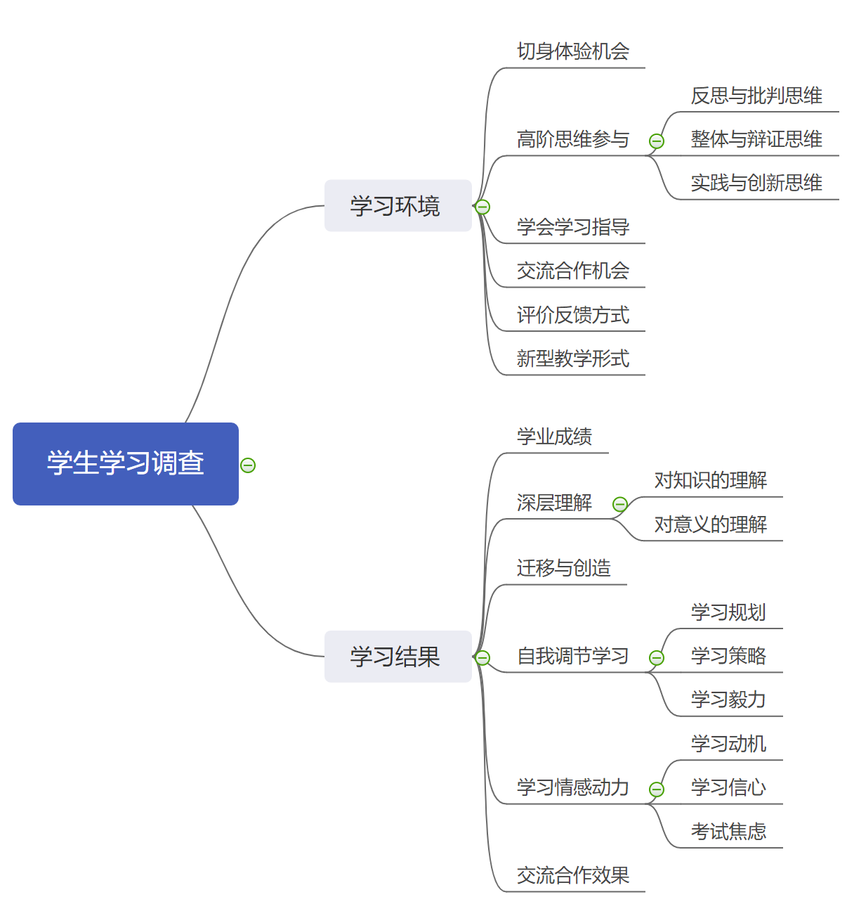

```{r setup, include=FALSE}
knitr::opts_chunk$set(
  echo = FALSE,
  fig.cap = TRUE,
  message = FALSE,
  warning = FALSE,
  fig.showtext = TRUE,
  dpi = 100,
  fig.align = "center",
  #fig.asp = 0.5,
  out.width = "\\textwidth" #' 99%',
  # fig.height = 4,
  # fig.width = 8
)

options(digits = 4)
```


```{r}
library(tidyverse)
library(stringr)
library(readxl)
library(flextable)
library(officedown)
library(officer)

load("data/myData.Rdata")

source("_common.R", encoding = "UTF-8")
```


主要结论

# 调查概况
## 教育改革背景

**教育在实践中走向面向未来的目标取向**

当今世界正处在急剧变革期，新理念、新技术和新模式不断涌现，如何更好地适应未来的世界变化是各国面临的共同难题。在知识经济时代，教育的地位、作用愈加凸显。当今世界各国教育的发展，不仅要基于过去人类知识和技能的传递，还应该面向当下经济社会发展的现实需求，更应该着眼人类社会未来的发展趋向。

**国际层面树立培育学生素养的教育趋势**

1996年国际21世纪教育委员会向联合国教科文组织提交了报告《教育——财富蕴藏其中》，其中最核心的思想是：教育要使学习者“学会认知、学会做事、学会共处、学会生存”。这一思想很快被全球各国所认可，并被称为学习的四大支柱。

1997年底，OECD和瑞士联邦统计署（SFSO）共同启动了一个名为“素养的界定与选择：理论和概念的基础（DeSeCo）”的跨国合作项目，将核心素养看作成功生活和健全社会的重要前提。2019年5月，OECD发布了学习框架2030的终稿——《OECD学习罗盘2030》。在2005年完成的DeSeCo项目基础上，针对不断变化的社会形势，对学生2030年应具备的知识、技能、态度与价值观所作出的新的分析和判断。学习框架2030作为未来一段时间内OECD测评学生能力和指导学生发展的基础，具有重要意义。


**国家层面探索学生培育的目标和路径**

美国国家研究院2012年发布报告《为了生活和工作的学习：在21世纪发展可迁移的知识与技能》，探讨深度学习与21世纪技能的融合，代表了美国教育变革与发展的新取向。报告将21世纪技能分为认知、自我、人际三大领域能力，并指出深度学习是其形成必不可少的过程。深度学习的本质是形成可迁移的知识，其过程包括建立事实、概念、程序、策略、信念五类知识的相关网络，可从使用合理的教学手段，重塑课堂设计以及以评促学、转变评估方式三个维度促进。2014年，由威廉和弗洛拉•休利特基金会发起、美国研究协会（AIR）策划并实施的“深度学习研究”（SDL）项目。基于实验学习的经
验，AIR最终确立了以掌握核心学业内容知识、有效沟通等在内的六维深度学习实践框架。

2014年教育部研制印发《关于全面深化课程改革落实立德树人根本任务的意见》，提出“教育部将组织研究提出各学段学生发展核心素养体系，明确学生应具备的适应终身发展和社会发展需要的必备品格和关键能力”。教育部委托北京师范大学，联合国内高校近百位专家成立课题组，历时3年完成的《中国学生发展核心素养》研究成果于2016年9月13日在京发布。核心素养以培养“全面发展的人”为核心，分为文化基础、自主发展、社会参与3个方面，综合表现为人文底蕴、科学精神、学会学习、健康生活、责任担当、实践创新六大素养，具体细化为国家认同等18个基本要点。2017年12月教育部印发《普通高中课程方案和语文等学科课程标准（2017年版）》，2020年6月印发《普通高中课程方案和语文等学科课程标准（2017年版2020年修订）》。


**学科科学为教与学的实践创新提供基点**

在知识社会，学习和创新能力成为个人和社会发展的重要动力，教育系统如何发展公民的这些能力以有效应对当前和未来的挑战，成为全球教育变革的焦点，而推动教育变革的重要驱力之一是对“人是如何学习的”这一问题的认识，以此作为核心研究问题的学习科学的兴起，引起了学术界和实践界的广泛关注。作为一个跨学科研究领域，学习科学兴起于20世纪80年代末，之后在世界范围内迅猛发展，吸引了神经科学、心理学、社会学、计算机科学、教育学等相关学科研究者的极大兴趣，并在此基础上逐渐形成了日趋明晰的学习科学专业领域。学习科学研究范围广阔、层次多样、方法多种。很多关于“人是如何学习的”成果对教育政策与实践是深有启示的，可是，真正地检验和把这些成果有效地用于真实学习场景（如课堂、博物馆，或企业中的成人培训），还有一段复杂和漫长的路，这是学习科学研究无法回避的使命。实践要求整合已有的多方面研究成果，从实证研究结果向实践方案的转变，即，从“是什么”到“怎么做”的转变，而这一转变过程中必须考虑多种复杂的因素，才可能使得实践方案具有现实可行性调查目的。


## 调查目的

在上述教育发展的大背景中，核心素养导向和学习科学引领下的教与学势在变革，学校教育重心逐渐从以教师的教为中心转变到以学生的学为中心。这种学习不再仅仅是学生掌握知识与技能的，而是以知识学习为载体，通过更深入的教学过程，引导学生能够活用知识，学会自我学习，发展与他人的交流合作能力。秉着这样的教育价值追求，遵循教育循证研究的要求，在调查学生学习状况时，我们尝试重新架构学生学习调查的框架，编制工具收集数据，数说学生学习的现状。据此为区域和学校课程教学改革提供数据参考和变革导向。


## 调查方法

### 调查框架

借鉴“深度学习研究”（SDL）项目实证研究总结的机会-结果实践行动理论，本次调查主要从学校给学生创设了怎样的学习环境和学习机会和学生学校效果如何两个大的方面入手，对学生在学校的学习情况进行摸底。对于学习环境，依据国际国内学生发展核心素养、深度学习中关注的重点内容，着重调查学习体验、高阶思维、学会学习、交流合作以及学习反馈方式、教学组织形式。对于学校效果，除了关注学业成绩，还调查学生对知识的理解与迁移运用、自我调节的学习、学习情感动力和交流合作。具体调查框架指标见下图：


```{r, out.width='90%', fig.asp = 1.1, fig.align='center', fig.cap='调查框架和指标体系'}

```


### 问卷的编制

在参考国外修订的两因素学习过程问卷（R-SPQ-2F）、学习动机性策略问卷（MSLQ）、学习风格量表（ILS）、学生学习方法和技能量表（ASSIST）、深层学习方法量表（NSSE DAL）等的基础上，根据知识论和学习理论的相关研究成果，结合国内学生在校学习实际情况，为上述调查框架中的二、三级指标选取合有有代表性的调查观测点，编制相应题目，经过反复修订，最终形成15道里克特量表式题目，每道题目里有多个描述不同教学行为和学习情感态度的表述，学生根据实际情况在4个选项中选择一项。

### 调查样本

本次调查通过学生自愿网上作答的方式收集数据，原则上要求每位初一年级的学生都需要完成问卷填答，但由于处于疫情特殊时期，本次调查的样本数量没有达到预期数量，共收集到有效数据7436，各个学校的样本数量见下表。鉴于此，本次报告内容主要针对全区和各个学校，不再涉及班级层面。

```{r tab.cap='调查的样本数量', tab.id='调查的样本数量'}
df_sampling %>% 
  flextable(cwidth = 1.2) %>% 
  width(j = 1, width = 1.5) 
```

### 数据处理

   对于学习环境的营造部分，根据数据代表的频率赋值为1-4的分数，分数越高表示频率越高。对于学习效果部分，据数据代表的符合程度和表述的正反面含义，反面含义的题目反向计分，赋值为1-4的分数，分数越高表示越符合描述的正向情况，即分数越高情况越好。最后，根据各个题目的赋值，按照指标体系合成各个指标分数，并转换为得分率。


# 调查结果分析

## 学习环境的营造

学习环境的营造主要探究在语文、数学、英语学科课堂教学过程中，教师有没有为学生学习创设能唤起学习兴趣、需要高阶思维参与、支持学习调控、鼓励同伴交流等的环境。调查结果表明，综合来看，全区学校在为学生提供切身体验、高阶思维、学会学习、交流合作方面的平均得分率在71.89%-78.59%之间，处于中等偏上的水平，仍然有较大提升空间。对于这些指标，协同外语校、通锦中学、天一学校、蜀西实验学校、七中万达学校、七中八一学校、成都三十三中、成都八中在学习环境的指标上均高于区平均得分率，五月花学校、铁中府河学校、蜀星外语校、人北中学、金牛中学、金牛实验中学、金牛区育梁学校、金牛区新徽学校、金牛区希望学校、金牛区腾飞学校、交大附中、成都十八中、成都三十六中、成博文武学校在学习环境的指标上均低于区平均得分率。


```{r, fig.width= 7, fig.height= 9}
levels <- c(
  "t_Practical_experience",
  #"t_Higher_order_thinking",
  
  "f_Higher_order_thinking_rethink",
  "f_Higher_order_thinking_whole",
  "f_Higher_order_thinking_practice", 
  
  "t_Learn_to_learn",
  "t_Cooperation"#,
 # "t_Knowledge_mastery"
)


df_all_index <- df_all %>%
  select(school, all_of(levels)) %>% 
  mutate(
    across(all_of(levels), list(RC = ~. >= last(.) ))
    ) %>% 
  rowwise() %>% 
  mutate(
    num_above_mean = sum(c_across(ends_with("_RC")))
  ) %>% 
  ungroup() %>% 
  select(-ends_with("_RC"))


library(ggthemr)
ggthemr("solarized")


df_all_index %>%
  pivot_longer(
    cols = all_of(levels),
    names_to = "index",
    values_to = "values"
  ) %>%
  group_by(index) %>%
  mutate(values_diff = values - last(values)) %>%
  ggplot(aes(
    x = factor(index, levels), 
    y = forcats::fct_reorder(school, num_above_mean) %>% 
        forcats::fct_relevel(., "全区"),
    size = values_diff,
    color = -sign(values_diff)
  )) +
  geom_point() +
  geom_text(
    aes(label = round(values, 2)),
    color = "white",
    size = 3
  ) +
  scale_x_discrete(labels = labels) +
  scale_size_continuous(range = c(5, 12)) +
  theme(
    axis.text.x = element_text(angle = 45, hjust = 1),
    legend.position = "none"
  ) +
  labs(
    x = NULL, y = NULL,
    title = "得分率的图",
    caption = "说明：红色代表高于区平均达标率，蓝色代表低于区平均达标率"
  )
```

### 切身体验的机会

体验学习容易引起学习者本身对学习的乐趣、共鸣、愉悦和专注，促使学生他们把自己学习的时空拓展到课外及与主题相关的领域，形成时常体会、感悟、反思、分享、生成、创新和钟情于所做之事的习惯。
调查结果表明，针对切身体验机会的具体指标， 直观感受事物、用心感受和揣摩、开展相应行动的全区平均得分率分别为77.54%、79.75%、67.04%。可见，教师教学过程中在通过用眼和用心唤醒学生学习比动手更多，学生能自己动手操作和探索的机会有待增加。


```{r tab.cap='切身体验机会具体指标的得分率', tab.id='切身体验机会具体指标的得分率'}
d %>%
  stats_option_prop(cur_option = content_Practical_experience) %>% 
  rename(" " = school) %>%
  flextable_print() 
```


### 高阶思维的机会

所谓高阶思维, 是发生在较高认知水平层次上的心智活动或较高层次的认知能力，是问题解决和创造力的核心。研究认为 ,高阶思维能力的发展需要高阶学习活动予以支持，高阶学习是一种需要学习者运用高阶思维的学习活动。我们将考察从反思与批判思维、整体与辩证思维、实践与创新思维三类具体高阶思维的培育和教学引导情况。

#### 反思与批判思维

反思与批判思维以一种合理的、反思的、心灵开放的方式进行思考，从而能够清晰准确地表达、逻辑严谨地推理、合理地论证。调查结果表明，针对反思与批判思维具体指标的培育，全区教师更关注让学生反思所讲所学的知识，在甄别不同思路，特别是质疑他人观点方面相对少些。


```{r tab.cap='反思与批判思维具体指标的得分率', tab.id='反思与批判思维具体指标的得分率'}
cur_content <- content_Higher_order_thinking[1:5]

d %>%
  stats_option_prop(cur_option = cur_content) %>%
  rename(" " = school) %>%
  flextable_print()
```

#### 整体与辩证思维

整体与辩证思维是从对象的各个方面的相互联系中进行考察，以便从整体上、本质上完整地认识对象。调查结果表明，针对整体与辩证思维具体指标的培育，教师在新旧知识的联系上已做得较好，但在跨学科的知识联系和知识关联的可视化方面还需加强。

```{r tab.cap='整体与辩证思维具体指标的得分率', tab.id='整体与辩证思维具体指标的得分率'}
cur_content <- content_Higher_order_thinking[6:10]

d %>%
  stats_option_prop(cur_option = cur_content) %>%
  rename(" " = school) %>%
  flextable_print()
```


#### 实践与创新思维

实践与创新思维就是能将知识迁移运用到实际问题的解决中，产生有创造性的想法。调查结果表明，针对实践与创新思维具体指标的培育，全区平均得分率明显低于高阶思维的其他两个方面，可见实践与创新思维是高阶思维的培育中难度和挑战最大的方面，也是教师教学过程中最容易忽略的方面。


```{r tab.cap='实践与创新思维具体指标的得分率', tab.id='实践与创新思维具体指标的得分率'}
cur_content <- content_Higher_order_thinking[11:16]

d %>%
  stats_option_prop(cur_option = cur_content) %>%
  rename(" " = school) %>%
  flextable_print()
```


### 学会学习指导

学会学习比学习本身更为重要，我们只有学会了学习，才能让学习走上良性循环，突破学习本身，增长智慧。调查结果表明，针对学会学习具体指标的培育，教师在引导学生相互指导上相对较好，但在鼓励学生向自己要求进一步厘清认识上较为欠缺。


```{r tab.cap='学会学习指导具体指标的得分率', tab.id='学会学习指导具体指标的得分率'}
d %>%
  stats_option_prop(cur_option = content_Learn_to_learn) %>%
  rename(" " = school) %>%
  flextable_print()
```


### 交流合作的机会

交流与合作是国外21世纪素养和深度学习中非常重要的方面，因为团队合作是学生在今后的生活和工作中所必须具备的能力，学生需要学会表达自己的观点、倾听别人的观点、融合双方的观点。调查结果表明，针对交流合作具体指标的培育较为局限于课堂上就相关问题进行讨论，但与其他同学一起完成任务、互相评价、当小老师等形式还较少。

```{r tab.cap='学交流合作具体指标的得分率', tab.id='学交流合作具体指标的得分率'}
d %>%
  stats_option_prop(cur_option = content_Cooperation) %>%
  rename(" " = school) %>%
  flextable_print()
```


### 评价反馈方式

反馈是近年来形成性评价中越来越关注的问题，国外教育教育心理学的研究表明反馈是影响对学生学业成绩的重要变量。根据评价的形式不同，反馈可以通过终结性评价达成，如期末考试，也可以在过程性评价中达成，如课堂上教师的评语、同学之间的互动、教师对作业的批改等。调查结果表明，在不同反馈形式中，考试、作业批改、课堂测验仍然是反馈的主要方式，可见教师更多关注的是偏向于结果的反馈，而在教学过程中给学生提供学习信息，如让学生知道自己现在在哪里、离目标有多远等不够。

```{r tab.cap='评价反馈方式具体指标的得分率', tab.id='评价反馈方式具体指标的得分率'}
d %>%
  stats_option_prop(cur_option = content_Feedback) %>%
  rename(" " = school) %>%
  flextable_print()
```


### 新型教学形式

随着课改的进行，项目式学习等多种形式的新教学方式在学校得以实践。基于项目式的学习、基于问题解决的学习、基于课题研究的学习各自的侧重点有区别，但都是强调知识的整合和运用，因此往往需要以跨学科的形式开展，打破学科的壁垒，调动不同学科的知识来完成项目、研究和解决问题。调查结果表明，这三种形式的教学形式的得分率都较低。
除了涉及开学可的新型教学形式，不断有学校尝试在学科教学中以学习单元为单位，通过以一定的逻辑线索为依据，对教材中相关知识进行重组和扩展，帮助学生更系统化的学习知识、了解知识之间的关联和知识所处的位置。调查结果表明，教师仍然以按照教材原有安排进行教学为主。


```{r tab.cap='新型教学形式具体指标的得分率', tab.id='新型教学形式具体指标的得分率'}
d %>%
  stats_option_prop(cur_option = content_Teaching_methods) %>%
  rename(" " = school) %>%
  flextable_print()
```


## 学习结果

调查结果表明，综合来看，全区学校在为学生提供切身体验、高阶思维、学会学习、交流合作方面的平均得分率在71.89%-78.59%之间，处于中等偏上的水平，仍然有较大提升空间。对于这些指标，协同外语校、七中万达学校、七中八一学校在学习结果的指标上均高于区平均得分率，蜀星外语校、金牛中学、金牛区育梁学校、金牛区新徽学校、金牛区希望学校、成都三十六中在学习结果的指标上均低于区平均得分率。


```{r, fig.width= 7, fig.height= 9}
levels <- c(
  "t_Understanding_nature_of_things",
  "t_Understanding_meaning_of_knowledge",
  "t_Application_of_knowledge",
  "t_Learning_planning",
  "t_Learning_strategy",
  "t_Learning_persistence",
  "t_Learning_motivation",
  "t_Learning_confidence",
  "t_Examination_anxiety",
  "t_Exchange_and_share",
  "t_Knowledge_mastery"
)


df_all_index <- df_all %>%
  select(school, all_of(levels)) %>% 
  mutate(
    across(all_of(levels), list(RC = ~. >= last(.) ))
    ) %>% 
  rowwise() %>% 
  mutate(
    num_above_mean = sum(c_across(ends_with("_RC")))
  ) %>% 
  ungroup() %>% 
  select(-ends_with("_RC"))


library(ggthemr)
ggthemr("solarized")


df_all_index %>%
  pivot_longer(
    cols = all_of(levels),
    names_to = "index",
    values_to = "values"
  ) %>%
  group_by(index) %>%
  mutate(values_diff = values - last(values)) %>%
  ggplot(aes(
    x = factor(index, levels), 
    y = forcats::fct_reorder(school, num_above_mean) %>% 
        forcats::fct_relevel(., "全区"),
    size = values_diff,
    color = -sign(values_diff)
  )) +
  geom_point() +
  geom_text(
    aes(label = round(values, 2)),
    color = "white",
    size = 3
  ) +
  scale_x_discrete(labels = labels) +
  scale_size_continuous(range = c(5, 12)) +
  theme(
    axis.text.x = element_text(angle = 45, hjust = 1),
    legend.position = "none"
  ) +
  labs(
    x = NULL, y = NULL,
    title = "得分率的图",
    caption = "说明：红色代表高于区平均达标率，蓝色代表低于区平均达标率"
  )
```


### 学业成绩

```{r, fig.width= 7, fig.height= 9}
d_sr <- d %>%
  rowwise() %>%
  mutate(
      total_score = 100 * sum(c_across(ends_with("202007"))) / 450
  ) %>%
 ungroup() %>%
  mutate(
    across(ends_with("202007"), ~ 100 *. / 150)
 )  %>%
 select(school,  ends_with("202007"), total_score )


d_sr_mean_district <- d_sr %>%
  ungroup() %>%
  summarise(
    across(c(ends_with("202007"), total_score), mean, na.rm = TRUE)
  ) %>%
  mutate(school = "全区", group = "district") %>%
  relocate(school, group)


d_sr_mean_school <- d_sr %>%
  ungroup() %>%
  group_by(school) %>%
  summarise(
   across(c(ends_with("202007"), total_score), mean, na.rm = TRUE)
  ) %>%
  mutate(group = "school") %>%
  relocate(school, group)


d_sr_all <- list(d_sr_mean_school, d_sr_mean_district) %>%
  reduce(bind_rows)


levels <- c(
  "chinese202007",
  "math202007",
  "english202007",
  "total_score"
)


df_all_index <- d_sr_all %>%
  select(school, all_of(levels)) %>% 
  mutate(
    across(all_of(levels), list(RC = ~. >= last(.) ))
    ) %>% 
  rowwise() %>% 
  mutate(
    num_above_mean = sum(c_across(ends_with("_RC")))
  ) %>% 
  ungroup() %>% 
  select(-ends_with("_RC"))


library(ggthemr)
ggthemr("solarized")


df_all_index %>%
  pivot_longer(
    cols = all_of(levels),
    names_to = "index",
    values_to = "values"
  ) %>%
  group_by(index) %>%
  mutate(values_diff = values - last(values)) %>%
  ggplot(aes(
    x = factor(index, levels), 
    y = forcats::fct_reorder(school, num_above_mean) %>% 
        forcats::fct_relevel(., "全区"),
    size = values_diff,
    color = -sign(values_diff)
  )) +
  geom_point() +
  geom_text(
    aes(label = round(values, 2)),
    color = "white",
    size = 3
  ) +
  scale_x_discrete(labels = labels) +
  scale_size_continuous(range = c(5, 12)) +
  theme(
    axis.text.x = element_text(angle = 45, hjust = 1),
    legend.position = "none"
  ) +
  labs(
    x = NULL, y = NULL,
    title = "得分率的图",
    caption = "说明：红色代表高于区平均达标率，蓝色代表低于区平均达标率"
  )
```


### 深层理解

#### 对知识的理解

对知识的理解包括对知识的发展、知识之间的关系、知识背后的方法和思想、知识的本质等的把握。根据学生作答的数据，全区学生自我评价对知识的理解得分率较高，集中在82.63%-84.95%之间。

```{r tab.cap='知识理解具体指标的得分率', tab.id='知识理解具体指标的得分率'}
d %>%
  stats_option_prop(cur_option = content_Understanding_nature_of_things) %>%
  rename(" " = school) %>%
  flextable_print()
```


#### 对意义的理解

学习除了把握知识，一个更重要的维度是理解知识的隐形一面，即知识所蕴含的价值以及对自己理想信念的启示，让生命散发意义的光辉。根据学生作答的数据，全区学生自我评价对意义的理解得分率较高。

```{r tab.cap='意义理解具体指标的得分率', tab.id='意义理解具体指标的得分率'}
d %>%
  stats_option_prop(cur_option = content_Understanding_meaning_of_knowledge) %>%
  rename(" " = school) %>%
  flextable_print()
```


### 知识迁移与创造

知识的迁移与创造是学生可以活学活用，将所学知识迁移到新的情境中，用知识解决实际问题，并能提出独特的个人看法。根据学生作答的数据，全区学生在提出独特或创新的个人见解上相对欠缺，这也是目前整个教育在学生创造力培养方面共同存在的短板。

```{r tab.cap='知识迁移创造具体指标的得分率', tab.id='知识迁移创造具体指标的得分率'}
d %>%
  stats_option_prop(cur_option = content_Application_of_knowledge) %>%
  rename(" " = school) %>%
  flextable_print()
```


### 学习自我调节

自我调节学习指学习者主动激励自己并且积极使用适当的学习策略的学习；是一种主动的与建构性的学习过程，在这个过程中，学生首先为自己确定学习目标，然后监视、调节、控制自己的认知、动机和行为。

#### 学习规划

根据学生作答的数据，全区学生在学习空间、计划上得分率较高，学习时间安排上稍弱。

```{r tab.cap='学习规划具体指标的得分率', tab.id='学习规划具体指标的得分率'}
d %>%
  stats_option_prop(cur_option = content_Learning_planning) %>%
  rename(" " = school) %>%
  flextable_print()
```

#### 学习策略

根据学生作答的数据，全区学生在复习书面材料上得分率较高，但在知识清单整理上稍弱。特别是反向问答的考试前复习的表述，选择不符合的比例相对较低。

```{r tab.cap='学习策略具体指标的得分率', tab.id='学习策略具体指标的得分率'}
d %>%
  stats_option_prop(cur_option = content_Learning_strategy) %>%
  rename(" " = school) %>%
  flextable_print()
```


#### 学习毅力

根据学生作答的数据，全区学生在无论学习内容都努力上得分率较高，但针对两道反向问答的表述，在坚持学习计划和克服学习困难上得分率较低。

```{r tab.cap='学习毅力具体指标的得分率', tab.id='学习毅力具体指标的得分率'}
d %>%
  stats_option_prop(cur_option = content_Learning_persistence) %>%
  rename(" " = school) %>%
  flextable_print()
```


### 学习情感动力

学习情感动力是学生学习的动力系统，主要调查了学生的学习动机、学习信心和考试焦虑。

#### 学习动机

从学生对学习本身的喜爱、学习带来的长远好处、为了好成绩三个方面调查学习动机。根据学生作答的数据，全区学生为了学习带来的长远好处和取得好成绩的需要较对对学习本身的好奇和渴望得分率要高一些。


```{r tab.cap='指向知识本身动机指标的得分率', tab.id='指向知识本身动机指标的得分率'}
cur_content <- content_Learning_motivation[1:3]

d %>%
  stats_option_prop(cur_option = cur_content) %>%
  rename(" " = school) %>%
  flextable_print()
```


```{r tab.cap='指向知识带来好处动机指标的得分率', tab.id='指向知识带来好处动机指标的得分率'}
cur_content <- content_Learning_motivation[4:6]

d %>%
  stats_option_prop(cur_option = cur_content) %>%
  rename(" " = school) %>%
  flextable_print()
```


```{r tab.cap='指向取得成绩动机指标的得分率', tab.id='指向取得成绩动机指标的得分率'}
cur_content <- content_Learning_motivation[7:8]

d %>%
  stats_option_prop(cur_option = cur_content) %>%
  rename(" " = school) %>%
  flextable_print()
```


#### 学习信心
根据学生作答的数据，全区学生整体学习信心得分率较高，但对于理解老师课堂上讲难度较高的内容信心不足。


```{r tab.cap='学习信心指标的得分率', tab.id='学习信心指标的得分率'}
d %>%
  stats_option_prop(cur_option = content_Learning_confidence) %>%
  rename(" " = school) %>%
  flextable_print()
```


#### 考试焦虑
考试焦虑部分的题目均是反向问答的表述，根据学生作答的数据，全区学生没有对考试存在下述心理焦虑感觉的得分率较低，可见学生普遍还是存在考试焦虑。

```{r tab.cap='考试焦虑指标的得分率', tab.id='考试焦虑指标的得分率'}
d %>%
  stats_option_prop(cur_option = content_Examination_anxiety) %>%
  rename(" " = school) %>%
  flextable_print()
```


### 交流合作效果

根据学生作答的数据，全区学生自我评价对交流合作得分率较高，集中在83.55%-92.81%之间，在分享自己观点上稍弱，但倾听他人发言上较好。

```{r tab.cap='交流合作效果指标的得分率', tab.id='交流合作效果指标的得分率'}
d %>%
  stats_option_prop(cur_option = content_Exchange_and_share) %>%
  rename(" " = school) %>%
  flextable_print()
```


## 关联分析

### 学习环境与学业成绩的相关


根据各个学校切身体验、高阶思维、学会学习、交流合作机会得分率与学业成绩的线性回归分析发现，整体呈现出这些机会得分率越高，学业成绩越好的趋势。可见，上述学习环境的营造对于提高学生学业成绩是有利的。


```{r, fig.height= 5, fig.width = 6, fig.cap= "这里缺一个caption"}
obs_vars <- c(
  "t_Practical_experience",
  "t_Higher_order_thinking",
  "t_Learn_to_learn",
  "t_Cooperation"#,
 # "t_Knowledge_mastery"
)


df_mean_school %>%
  select(school, all_of(obs_vars), t_Knowledge_mastery) %>% 
  pivot_longer(
    cols = all_of(obs_vars),
    names_to = "index",
    values_to = "values"
  ) %>% 
 
  ggplot(aes(x = values, y = t_Knowledge_mastery)) +
  geom_point(alpha = 0.5)  +
  geom_smooth(method = lm) +
  facet_wrap(vars(index), scales = "free", labeller = as_labeller(labels)) +
  labs(x = NULL, y = NULL)
```


计算评价反馈方式频繁程度不同学生对应的学业成绩，对两者进行比较，下述终结性评价和过程性评价开展较多的学生成绩显著高于低频率组。


```{r}
d1 <- d %>%
  rowwise() %>%
  mutate(
    t_Knowledge_mastery = 100 * sum(c_across(ends_with("202007"))) / 450
  ) %>%
  select(
    school,
    all_of(c(content_Feedback, content_Teaching_methods)),
    t_Knowledge_mastery
  )
#d1


d2 <- d1 %>% mutate(
  across(all_of(c(content_Feedback, content_Teaching_methods)), 
         ~if_else(. %in% c(1, 2), "A", "B"))
)
```


- A组（1选项，2选项）比B组（3选项, 4选项）的成绩好

```{r tab.cap='', tab.id=''}
d2 %>% select(
    school,
    all_of(content_Feedback),
    t_Knowledge_mastery
  ) %>% 
  pivot_longer(
  cols = all_of(content_Feedback), 
  names_to = "question",
  values_to = "options"
) %>% 
  group_by(question, options) %>% 
  summarise(
    mean = mean(t_Knowledge_mastery)
  ) %>% 
  pivot_wider(
    names_from = "options",
    values_from = "mean"
  ) %>% 
  rename("问题" = question,
         "总是和经常" = A,
         "有时和从不" = B
         ) %>%
    flextable::flextable(cwidth = 1.7)
```


计算新型教学形式频繁程度不同学生对应的学业成绩，对两者进行比较，下述新型教学形式开展较多的学生成绩显著高于低频率组。


```{r}
d2 %>% select(
    school,
    all_of(content_Teaching_methods),
    t_Knowledge_mastery
  
  ) %>% 
  pivot_longer(
  cols = all_of(content_Teaching_methods), 
  names_to = "question",
  values_to = "options"
) %>% 
  group_by(question, options) %>% 
  summarise(
    mean = mean(t_Knowledge_mastery)
  ) %>% 
  pivot_wider(
    names_from = "options",
    values_from = "mean"
  ) %>% 
  rename("问题" = question,
         "总是和经常" = A,
         "有时和从不" = B
         ) %>%
    flextable::flextable(cwidth = 1.7)
```


```{r, results= "asis", ft.align = "left", eval=FALSE}
d2 %>% select(
    school,
    all_of(c(content_Feedback, content_Teaching_methods)),
    t_Knowledge_mastery
  ) %>% 
  
  pivot_longer(
  cols = -c(school, t_Knowledge_mastery), 
  names_to = "question",
  values_to = "options"
) %>% 
  group_by(school, question, options) %>% 
  summarise(
    mean = mean(t_Knowledge_mastery)
  ) %>% 
  pivot_wider(
    names_from = "options",
    values_from = "mean"
  ) %>% 
  rename("问题" = question,
         "总是和经常" = A,
         "有时和从不" = B
         ) %>%
  ungroup() %>% 
  group_by(school) %>% 
  group_map(
   # ~ flextable::flextable(.x, cwidth = 1.4) %>% flextable::docx_value() ,
     ~ knitr::kable(.x),
    .keep = TRUE
    )
```


```{r, results= "asis", eval=FALSE}
d2_split <- d2 %>% 
  select(
    school,
    all_of(c(content_Feedback, content_Teaching_methods)),
    t_Knowledge_mastery
  ) %>% 
  pivot_longer(
  cols = -c(school, t_Knowledge_mastery), 
  names_to = "question",
  values_to = "options"
) %>% 
  group_by(school, question, options) %>% 
  summarise(
    mean = mean(t_Knowledge_mastery)
  ) %>% 
  pivot_wider(
    names_from = "options",
    values_from = "mean"
  ) %>% 
  rename("问题" = question,
         "总是和经常" = A,
         "有时和从不" = B
         ) %>%
  ungroup() %>% 
  group_split(school) 

map(d2_split, flextable_list_display)
```


### 学习结果与学业成绩的相关


根据各个学校深层理解、迁移创造、自我调节、情感动力、合作交流得分率与学业成绩的线性回归分析发现，整体呈现出这些学习结果得分率越高，学业成绩越好的趋势。可见，上述学习结果与学生学业成绩是共同促进的关系。


```{r, fig.height= 7, fig.width=7, fig.cap= "学习环境与成绩的相互关系"}
obs_vars <- c(
  "t_Understanding_nature_of_things",
  "t_Understanding_meaning_of_knowledge",
  "t_Application_of_knowledge",
  "t_Learning_planning",
  "t_Learning_strategy",
  "t_Learning_persistence",
  "t_Learning_motivation",
  "t_Learning_confidence",
  "t_Examination_anxiety"#,
  #"t_Exchange_and_share",
  #"t_Knowledge_mastery"
)


df_mean_school %>%
  select(school, all_of(obs_vars), t_Knowledge_mastery) %>% 
  pivot_longer(
    cols = all_of(obs_vars),
    names_to = "index",
    values_to = "values"
  ) %>% 
 
  ggplot(aes(x = values, y = t_Knowledge_mastery)) +
  geom_point(alpha = 0.5)  +
  geom_smooth(method = lm) +
  facet_wrap(vars(index), scales = "free", labeller = as_labeller(labels)) +
  labs(x = NULL, y = NULL)
```


# 建议