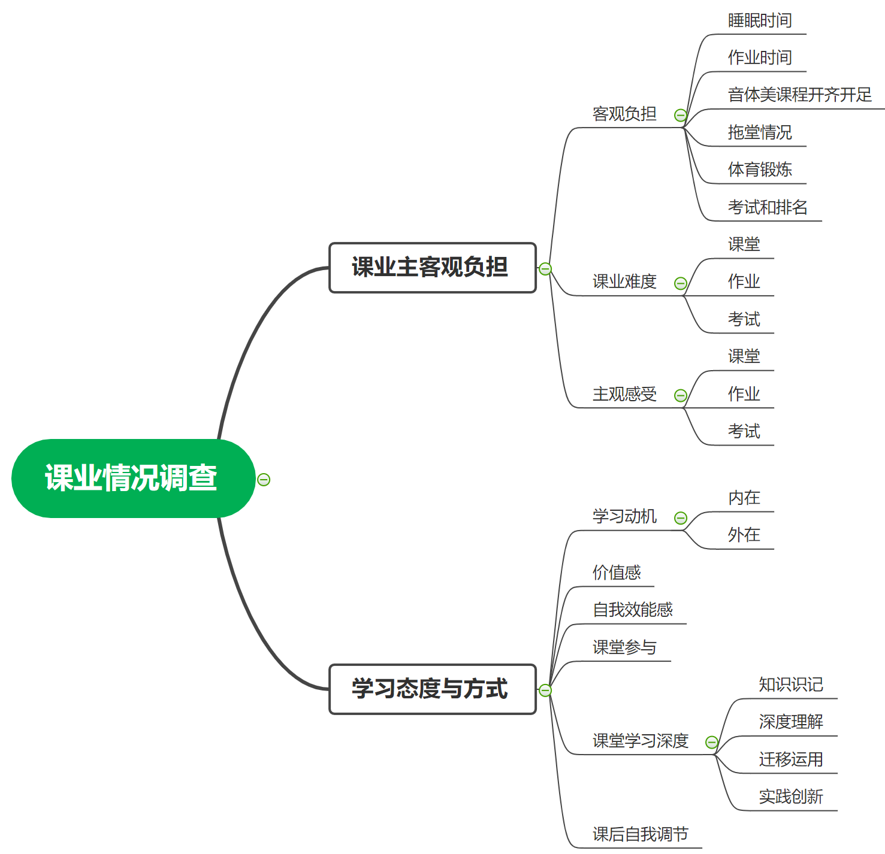

```{r setup, include=FALSE}
knitr::opts_chunk$set(
  echo = FALSE,
  fig.cap = TRUE,
  message = FALSE,
  warning = FALSE,
  #fig.showtext = TRUE,
  dev = "ragg_png",
  dpi = 300,
  fig.align = "center",
  fig.asp = 0.6,
  fig.width = 6,
  fig.path = "images/",
  out.width = "\\textwidth" #' 99%',
)

options(digits = 4)
```


```{r}
library(tidyverse)
library(stringr)
library(readxl)
library(flextable)
library(officedown)
library(officer)
library(ragg)

load("data/myData_df5.Rdata")

source("_common.R", encoding = "UTF-8")
```


```{r}
fp <- fp_par(text.align = "justify", 
             padding = 10,
             line_spacing = 1.5,
             keep_with_next = TRUE)
```

# 调查概况
## 调查目的和内容

`r ftext("空格", fp_text(color = "white"))`本次调查时为了了解学生在校学习的课业负担和学习过程，为学校管理完善和教学方式改进提供基础参考。调查内容包括课业负担和学习态度与方式两个主要板块。课业负担主要从客观负担、课业难度和主观感受三个方面进行考查；学习态度与方式从学习动机、价值感、自我效能感、课堂参与、课堂学习深度、课后自我调节六个方面进行考查。五、六年级调查的学习态度方法分别针对调考的数学、语文学科。`r fp`

## 调查方法

`r ftext("空格", fp_text(color = "white"))`本次调查采用网络问卷调查的方式进行，问卷为自编问卷，参考了国外PISA、TIMSS等学生大型测评项目中的调查问卷和学习动机性策略问卷（MSLQ）、学习过程问卷（LPQ）等针对学习过程的量表型问卷。同时，客观负担部分主要参考了教育部等九部门关于印发中小学生减负措施的通知（教基〔2018〕26号）、中共中央 国务院关于深化教育教学改革全面提高义务教育质量的意见（2019年6月23日）等政策文件中对睡眠时间、作业时间等的要求。问卷的指标框架如下：`r fp`

```{r, out.width='90%', fig.asp = 1.1, fig.align='center', fig.cap='调查框架和指标体系'}

```


## 调查数据

`r ftext("空格", fp_text(color = "white"))`与本次学科调考的成绩关联后，五、六年级的有效数据分别为37所学校的8,440人、36所学校的7,665人。每所学校的具体人数统计如下：`r fp`


```{r tab.cap='有效学生总数', tab.id='有效学生总数'}
df5_all %>% 
  select(school, starts_with("num_effect")) %>%
  set_names(c("学校", "五年级")) %>%
  flextable_print() %>%
  height_all(height = 0.1) %>%
  fit_to_width(max_width = 6) %>%
  fontsize(size = 9, part = "body") 
```


# 结果分析

## 课业主客观负担
### 客观负担


`r ftext("空格", fp_text(color = "white"))`根据调查数据结果，全区五年级睡眠时间、家庭作业时间、音乐课开课情况、美术课开课情况、体育课开课情况、参加体育锻炼时间、统考次数、考试成绩公布和排名的达标率分别为45.14%、76.82%、85.07%、85.13%、83.82%、90.55%、63.35%、73.61%。具体如下：`r fp`


```{r, fig.width= 6, fig.height = 3, fig.cap= "全区五年级课业客观负担达标率"}
df5_all %>%
  filter(level == "district") %>%
  select(starts_with("percent_")) %>%
  rename_with(everything(), .fn = ~str_replace_all(.x, pattern = pairs56)) %>%
  pivot_longer(
    cols = everything(),
    names_to = "index",
    values_to = "value"
  ) %>%
  mutate(value = as.numeric(value)) %>%
  ggplot(aes(x = value, y = fct_reorder(index, value)) ) +
  geom_col(width = 0.6, fill = "gray80") +
  geom_text(aes(label = value), hjust = 1) +
  theme_classic() +
  scale_x_continuous( expand = c(0, 0)) +
  labs(x = NULL, y = NULL)
```

`r ftext("空格", fp_text(color = "white"))`在学校层面，草堂小学、鼓楼小学、实小明道分校、实小青华分校、实小文苑分校、实验小学、双眼井小学五年级在所有指标上的达标率都高于区平均达标率；彩虹小学、金沙小学、少城小学、新华路小学五年级在所有指标上的达标率都低于区平均达标率。具体如下：`r fp`

```{r tab.cap='五年级客观负担达标率', tab.id='五年级客观负担达标率'}
df5_all %>%
  select(school, starts_with("percent_")) %>%
  mutate(
    across(starts_with("percent_"), list(RC = ~. >= last(.) ))
    ) %>% 
  rowwise() %>% 
  mutate(
    num_above_mean = sum(c_across(ends_with("_RC")))
  ) %>% 
  ungroup() %>% 
  select(-ends_with("_RC")) %>%
  arrange(desc(num_above_mean)) %>%
  arrange(school %in% c("全区")) %>%
  
  rename_with(everything(), .fn = ~str_replace_all(.x, pattern = pairs56)) %>%
  flextable_print() %>% 
  fit_to_width(max_width = 8) %>%
  fontsize(size = 8, part = "body") %>%
  add_footer_row(values = "说明：灰色底纹表示得分率高于或等于区平均达标率，下同。", colwidths = 10)
```


`r ftext("空格", fp_text(color = "white"))` 与2019年的调查数据对比，除了睡眠时间，全区五、六年级学生在家庭作业时间、音乐课开课情况、美术课开课情况、体育课开课情况、参加体育锻炼时间、统考次数、考试成绩公布和排名上的达标率均有所提升。因此，就纵向比较而言，全区在减轻学生课业客观负担上效果显著。具体如下：（各学校的情况，见附录）`r fp`


```{r, fig.cap= "全区五年级课业客观负担达标率与去年对比"}
file <- knitr::fig_path('percent.png')

agg_png(file, res = 300, height = 3.6, width = 6, units = "in")

levels <- c(
    "睡眠时间", 
    "家庭作业时间", 
    "音乐课开课情况",
    "美术课开课情况", 
    "体育课开课情况",
    "参加体育锻炼时间", 
    "考试成绩公布和排名"
)


p <- df5_burden_percent_combine %>%
  filter(level == "district") %>%
  pivot_longer(
    cols = starts_with("value"),
    names_to = "year",
    names_pattern = "value(\\d+)",
    values_to = "value"
  ) %>%
  mutate(value = as.numeric(value)) %>%
  ggplot(aes(x = factor(index, levels), 
             y = value, fill = year, label = value)
         ) +
  geom_col(width = 0.6, position = position_dodge(0.6)) +
  geom_text(position = position_dodge(width = 0.9),
            vjust = -0.5,
            size = 3
            ) +
  scale_fill_discrete(direction = -1) +
  scale_x_discrete(
    labels =  c("睡眠时间", 
                "家庭作业\n时间", 
                "音乐课\n开课情况",
                "美术课\n开课情况", 
                "体育课\n开课情况",
                "参加体育\n锻炼时间", 
                "考试成绩\n公布和排名")
  ) +
  scale_y_continuous(expand = expansion(mult = c(0, .12))) +
  theme_classic() +
  theme(legend.position = "top") +
  labs(x = NULL, y = NULL, fill = "年份") 


print(p)
invisible(dev.off())

knitr::include_graphics(file)
```


`r ftext("空格", fp_text(color = "white"))`此外，本次调查还考查了教师拖堂情况。根据调查数据结果，全区五年级学生报告语文老师、数学老师、英语老师、其他课的老师拖堂的比例分别为14.88%、17.91%、6.03%、5.26%，整体上74.38%的老师没有拖堂。可见，语文和数学老师拖堂的情况明显多于其他学科教师。具体如下`r fp`

```{r, fig.width= 6, fig.height = 3, fig.cap= "全区五年级老师拖堂比例"}
df5_all %>%
  filter(level == "district") %>%
  select(starts_with("teacher_")) %>%
  rename_with(everything(), .fn = ~str_replace_all(.x, pattern = pairs56)) %>%
  pivot_longer(
    cols = everything(),
    names_to = "index",
    values_to = "value"
  ) %>%
  mutate(value = as.numeric(value)) %>%
  ggplot(aes(x = value, y = fct_reorder(index, value)) ) +
  geom_col(width = 0.6, fill = "gray80") +
  geom_text(aes(label = value, hjust = ifelse(value > 50, 1, -.1)) ) +
  theme_classic() +
  scale_x_continuous( expand = c(0, 0)) +
  labs(x = NULL, y = NULL)
  
```


`r ftext("空格", fp_text(color = "white"))`学校层面五年级各校教师拖堂比例统计如下：`r fp`

```{r tab.cap='五年级拖堂情况比例', tab.id='五年级拖堂情况比例'}
df5_all %>%
  select(school, starts_with("teacher_")) %>%
  rename_with(everything(), .fn = ~str_replace_all(.x, pattern = pairs56)) %>%
  flextable_print() %>% 
  fit_to_width(max_width = 6) %>%
  fontsize(size = 9, part = "body") 
```


### 课业难度

`r ftext("空格", fp_text(color = "white"))`根据调查数据结果，全区学生感知的语文/数学课业难度不高，但考试的难度明显高于课堂和作业。具体如下：`r fp`

```{r, fig.width= 5, fig.height = 2, fig.cap= "全区五年级数学课业难度得分率"}
df5_all %>%
  filter(level == "district") %>%
  select(starts_with("f_hard_")) %>%
  rename_with(everything(), .fn = ~str_replace_all(.x, pattern = pairs56)) %>%
  pivot_longer(
    cols = everything(),
    names_to = "index",
    values_to = "value"
  ) %>%
  mutate(value = as.numeric(value)) %>%
  ggplot(aes(x = value, y = fct_reorder(index, value)) ) +
  geom_col(width = 0.6, fill = "gray80") +
  geom_text(aes(label = value), hjust = 1) +
  theme_classic() +
  scale_x_continuous( expand = c(0, 0)) +
  labs(x = NULL, y = NULL)
  
```


### 主观感受

`r ftext("空格", fp_text(color = "white"))`
根据调查数据结果，全区五、六年级学生对课堂、考试和作业主要以积极的体验为主，具体表现为语文课上开心、语文考试高兴、语文作业享受；同时，也存在一定的消极情绪，如语文课上紧张、语文考试紧张、语文作业焦虑、语文作业厌倦等，在消极情绪中，课堂的消极情绪高于考试和作业。`r fp`


```{r, fig.width= 5, fig.height = 2.5, fig.cap= "全区五年级数学主观感受得分率"}
df5_all %>%
  filter(level == "district") %>%
  select(starts_with("f_feeling_")) %>%
  rename_with(everything(), .fn = ~str_replace_all(.x, pattern = pairs56)) %>%
  pivot_longer(
    cols = everything(),
    names_to = "index",
    values_to = "value"
  ) %>%
  mutate(value = as.numeric(value)) %>%
  ggplot(aes(x = value, y = fct_reorder(index, value)) ) +
  geom_col(width = 0.6, fill = "gray80") +
  geom_text(aes(label = value), hjust = 1) +
  theme_classic() +
  scale_x_continuous( expand = c(0, 0)) +
  labs(x = NULL, y = NULL)
  
```

`r ftext("空格", fp_text(color = "white"))`五年级各校学生主观感受到的数学课业情绪得分率统计如下：`r fp`

```{r tab.cap='五年级学习主观感受得分率', tab.id='五年级学习主观感受得分率'}
df5_all %>%
  select(school, starts_with("f_feeling_")) %>%
  rename_with(everything(), .fn = ~str_replace_all(.x, pattern = pairs56)) %>%
  flextable_print() %>%
  vline(j = c('课堂积极情绪', '考试积极情绪'), part = "all") %>% 
  fit_to_width(max_width = 6) %>%
  fontsize(size = 9, part = "body") 
```


## 学习态度与方式

### 学习态度价值


`r ftext("空格", fp_text(color = "white"))`根据调查数据结果，全区五年级学生对数学价值的认可得分率最高，为92.37%，其中，表明绝多数学生都认为在数学课上所学的东西在实际生活中会用到的，所学的数学知识在生活中很重要，需要学好数学。
学生学习内在和外在动机的得分率分别为85.53%、73.52%，其中，说明整体上学生学习的动力来自自己的兴趣、好奇心等内在需求要多于来自与他人的竞争和升学的需要。
学生数学学习自我效能感的得分率为80.95%，其中，表明大多数学生觉得自己数学学得很好，擅长解答难的数学题，数学比其他任何科目都简单。`r fp`

```{r, fig.width= 6, fig.height = 2, fig.cap= "全区五年级数学学习态度情感得分率"}
df5_all %>%
  filter(level == "district") %>%
  select(starts_with("f_learning_")) %>% 
  rename_with(everything(), .fn = ~str_replace_all(.x, pattern = pairs56)) %>%
  pivot_longer(
    cols = everything(),
    names_to = "index",
    values_to = "value"
  ) %>%
  mutate(value = as.numeric(value)) %>%
  ggplot(aes(x = value, y = fct_reorder(index, value)) ) +
  geom_col(width = 0.6, fill = "gray80") +
  geom_text(aes(label = value), hjust = 1) +
  theme_classic() +
  scale_x_continuous( expand = c(0, 0)) +
  labs(x = NULL, y = NULL)
  
```

`r ftext("空格", fp_text(color = "white"))`五年级各校学生的数学学习态度价值得分率统计如下：`r fp`

```{r tab.cap='五年级数学学习态度情感得分率', tab.id='五年级数学学习态度情感得分率'}
df5_all %>%
  select(school, starts_with("f_learning_")) %>% 
  rename_with(everything(), .fn = ~str_replace_all(.x, pattern = pairs56)) %>%
  flextable_print() %>% 
  fit_to_width(max_width = 6) %>%
  fontsize(size = 9, part = "body") 
```


### 课堂学习与调节

`r ftext("空格", fp_text(color = "white"))`根据调查数据结果，针对数学课堂上的学习行为，全区五年级学生课堂参与的得分率为85.08%，表明学生课堂上在认真听老师讲课、积极和同学讨论、表达自己的观点、动脑筋思考老师提的问题、举手回答老师的提问、细观察老师呈现的事物、动手操作研究事物等方面能积极投入。`r fp`

`r ftext("空格", fp_text(color = "white"))`五年级数学课堂上涉及到知识识记的得分率为87.95%，涉及到深度理解的得分率为86.65%，涉及到迁移运用的得分率为88.25%，涉及到学习涉及知识创新的得分率为81.72%。可见目前课堂上的学习已经在追求深度，除了奠定知识识记的基础，越来越关注知识的理解和运用，由数据可知最高层次的实践创新相对弱一些。`r fp`

`r ftext("空格", fp_text(color = "white"))`数学课后学生自我调节的得分率为86.08%，表明大多数学生都能够根据自己的学习情况进行自我评估、反思困惑，调整学习目标、方式。`r fp`


```{r, fig.width= 6, fig.height = 2.5, fig.cap= "全区五年级数学课堂学习与调节得分率"}
df5_all %>%
   filter(level == "district") %>%
   select(
         f_learning_activity_inclass, 
         starts_with("f_knowledge_"),
         f_learning_strategy
         ) %>%
  rename_with(everything(), .fn = ~str_replace_all(.x, pattern = pairs56)) %>%
  pivot_longer(
    cols = everything(),
    names_to = "index",
    values_to = "value"
  ) %>%
  mutate(value = as.numeric(value)) %>%
  ggplot(aes(x = value, y = fct_reorder(index, value)) ) +
  geom_col(width = 0.6, fill = "gray80") +
  geom_text(aes(label = value), hjust = 1) +
  theme_classic() +
  scale_x_continuous( expand = c(0, 0)) +
  labs(x = NULL, y = NULL)
  
```

`r ftext("空格", fp_text(color = "white"))`五年级各校学生数学学习与调节的得分率统计如下：`r fp`

```{r tab.cap='五年级数学课堂学习与调节得分率', tab.id='五年级数学课堂学习与调节得分率'}
df5_all %>%
  select(school, 
         f_learning_activity_inclass, 
         starts_with("f_knowledge_"),
         f_learning_strategy
         ) %>%
  rename_with(everything(), .fn = ~str_replace_all(.x, pattern = pairs56)) %>%
  flextable_print() %>% 
  fit_to_width(max_width = 6) %>%
  fontsize(size = 9, part = "body") 
```

`r ftext("空格", fp_text(color = "white"))`根据调查数据结果，针对语文课堂上的学习行为，全区六年级学生课堂参与的得分率为86.31%，表明学生课堂上在认真听老师讲课、积极和同学讨论、表达自己的观点、动脑筋思考老师提的问题、举手回答老师的提问、细观察老师呈现的事物、动手操作研究事物等方面能积极投入。`r fp`


## 学习成绩的差异分析

`r ftext("空格", fp_text(color = "white"))`将学习成绩按照高低分为高分组、中分组和低分组，对三个组学生对应的学习态度与方式的差异显著性分析显示，五、六年级三个组的学生在本次调查的学习态度与方式上均存在显著差异。高分组的学生的特征是：在课业情绪方面，课堂、考试和作业情绪感受更加积极；在学习态度方面，更加认可语文/数的学习价值和实际用处，学习动力更加来自内心对学习的喜爱和好奇，自我感受到有能力学好；在课堂参与中更加专注于教师的引导，积极思考和表达；在课堂的学习过程中从知识识记、深度理解到迁移运用和实践创新，奠定好了知识的基础，并深入理解和迁移运用，尝试进行的创新。具体如下：`r fp`


```{r tab.cap='五年级不同学习成绩分组下各指标均值', tab.id='五年级不同学习成绩分组下各指标均值', eval=FALSE}
df5_scoring_rate %>% 
  select(-starts_with("t")) %>%
  mutate(group = case_when(
    score >= quantile(score, probs = c(0.27, 0.73))[2] ~ "high", 
    score <= quantile(score, probs = c(0.27, 0.73))[1] ~ "low",
    TRUE ~ "middle"
    ) ) %>%
  
  group_by(group) %>%
  summarise(
    across(starts_with("f_"), ~100*mean(.))
  ) %>% 
  pivot_longer(
    cols = -group
  ) %>%
  pivot_wider(
    names_from = group,
    values_from = value
  ) %>%
  mutate(name = recode(name, !!!pairs56)) %>%
  select("指标" = name, "低分组得分率" = low, "中间组得分率" = middle, "高分组得分率" = high) %>%
  flextable() %>% 
  fit_to_width(max_width = 6) %>%
  fontsize(size = 9, part = "body") 
```


```{r, fig.width= 7, fig.height = 7, fig.cap= "全区五年级数学不同学习成绩分组下各指标均值"}
library(colorspace) 

levels_3 <- c("低分组", "中间组", "高分组")
threegroup <- c(low = "低分组", middle = "中间组", high = "高分组")


grouped_index5 <- 
  df5_scoring_rate %>% 
  select(-starts_with("t")) %>%
  mutate(group = case_when(
    score >= quantile(score, probs = c(0.27, 0.73))[2] ~ "high", 
    score <= quantile(score, probs = c(0.27, 0.73))[1] ~ "low",
    TRUE ~ "middle"
    ) ) %>%
  group_by(group) %>%
  summarise(
    across(c(starts_with("f_feeling_"), 
             starts_with("f_knowledge_"), 
             starts_with("f_learning_")), ~100*mean(.))
  ) %>% 
  pivot_longer(
    cols = -group
  ) %>%
  mutate(name = recode(name, !!!pairs56)) %>%
  mutate(group = recode(group, !!!threegroup)) %>%
  mutate(name = factor(name, 
              levels = c("课堂消极情绪",
                         "课堂积极情绪",
                         "考试消极情绪",
                         "考试积极情绪",
                         "作业消极情绪",
                         "作业积极情绪",
                         "来自内在的动力",
                         "来自外部的动力",
                         "价值感",
                         "学习效能",
                         "课堂参与",
                         "知识识记",
                         "深度理解",
                         "迁移运用",
                         "实践创新",
                         "自我调节"))
  )


grouped_index5 %>%
  mutate(group = factor(group, levels = levels_3)) %>%
  
  ggplot(
    aes(x = value, y = group, fill = group)
    ) +
  geom_col(width = 0.6) +
  geom_text(aes(label = round(value, 2)), hjust = 1) +

  theme(legend.position = "none") +
  scale_x_continuous( expand = c(0, 0)) +
  scale_fill_discrete_sequential(palette = "Peach") +
  labs(x = NULL, y = NULL) +
  facet_wrap(vars(name), scales = "free_y")
```


```{r, fig.width=8, fig.height=8, eval=FALSE}
grouped_index5 %>%
  ggplot(
    aes(x = value, 
        y = tidytext::reorder_within(group, value, name),
        fill = group)
    ) +
  geom_col(width = 0.6) +
  geom_text(aes(label = round(value, 2)), hjust = 1) +
  tidytext::scale_y_reordered() + 
  theme(legend.position = "none") +
  scale_x_continuous( expand = c(0, 0)) +
  labs(x = NULL, y = NULL) +
  facet_wrap(vars(name), scales = "free")
```


```{r,eval=FALSE}
library("GGally")
df5_all %>%
  select(starts_with("test_"), starts_with("f_")) %>%
  mutate(
    across(everything(), as.numeric)
  ) %>%
  rename_with(everything(), .fn = ~str_replace_all(.x, pattern = pairs56)) %>%
  ggcorr(palette = "RdBu", label = TRUE)
```


```{r, eval=FALSE}
df6_all %>%
  select(school, starts_with("test_"), starts_with("f_")) %>%
  ggplot(aes(x = test_score)) +
  geom_density()
```


# 主要结论

`r ftext("空格", fp_text(color = "white"))`通过调查发现全区在以下方面表现良好：`r fp`

- 与2019年的调查数据对比，除了睡眠时间，全区五、六年级在减轻学生课业客观负担上效果显著，家庭作业时间、音乐课开课情况、美术课开课情况、体育课开课情况、参加体育锻炼时间、统考次数、考试成绩公布和排名的达标率均有所提升。`r fp`

- 草堂小学、鼓楼小学、实小明道分校、实小青华分校、实小文苑分校、实验小学、双眼井小学五年级在所有指标上的得分率都高于区平均得分率；草堂小学、鼓楼小学、金沙小学、泡桐树小学、实小青华分校、实验小学六年级在所有指标上的得分率都高于区平均得分率。`r fp`

- 全区五、六年级学生感知的语文/数学课业难度不高。`r fp`

- 全区五、六年级学生对语文/数学课堂、考试和作业的情绪以积极的体验为主。`r fp`

- 全区五年级学生对数学的价值感、内在动机和效能感较高，六年级学生对语文的价值感、内在动机较高。`r fp`

- 全区五、六年级学生的语文/数学课堂参与度较高，课堂上学习过程中涉及到的较多的知识识记、深度理解和迁移运用。`r fp`

- 全区五、六年级学生大多数都能够根据自己的学习情况进行自我评估、反思困惑，调整学习目标、方式。`r fp`

`r ftext("空格", fp_text(color = "white"))`同时，数据也反映存在一定的问题需要改善：`r fp`

- 五、六年级学生睡眠时间的达标率分别只有45.14%、39.43%，与其他指标相比，亟待提高。`r fp`

- 彩虹小学、金沙小学、少城小学、新华路小学五年级在所有指标上的得分率都低于区平均得分率；彩虹小学、浣花小学、文翁实验小学、西财附小六年级在所有指标上的得分率都低于区平均得分率。`r fp`

- 全区五、六年级学生在语文/数学课堂和考试中存在一定的消极情绪。`r fp`

- 全区五、六年级学生感知的语文/数学考试的难度明显高于课堂和作业。`r fp`

- 全区六年级学生对语文的效能感有提高空间。`r fp`

- 全区五、六年级学生课堂上语文/数学学习过程中涉及到的实践创新有增大空间。`r fp`


# 改进建议

`r ftext("空格", fp_text(color = "white"))`在客观负担方面，根据调查结果，目前在学生每天睡眠时间、作业时间、统考次数、考试成绩公布和排名较上仍然没有完全达标。因此，学校还需加强对作业布置、考试安排的合规安排，区域行政部门保持对学校课业客观负担的监管力度。同时，对于学生睡眠时间的保证、作业时间的降低，还需要学校与家庭形成合力。学校要赢得家长的支持和理解，在减负上能做到“家校同步”，共同为学生的健康成长搭建更多更宽广的平台。`r fp`

`r ftext("空格", fp_text(color = "white"))`在主观感受方面，为了让学习变为更有意义，可以加强对学生的生涯规划教育，让学生不再就学习而论学习，而是充分认识到学习对自己人生的意义。此外，还可以激发学生学习的兴趣，加深学习与学生个体的关联感。学校要把激发学生的学习兴趣作为第一要务，从生理上和心理上为学生减负，让学生觉得学习、听课、作业等不再成为负担。`r fp`

`r ftext("空格", fp_text(color = "white"))`在课堂教学方面， 在教学设计上，教师应为学生提供问题或任务，这些问题或任务具有多种解决方案和解决途径，如创造性写作、推理、辩论和在现实生活中解决问题。对于一个定义不清的问题，学生可以自由地猜测和探索，而不用担心提供错误的答案，并且可以用自己的方式解决好奇心。通过解决好奇心，这种自主解决问题的过程是产生兴趣的重要来源。学习材料应该包含新颖性，不确定性和惊奇性，教师可以使用真实生活中的真实材料来促进个人关系，并强调学习知识的价值，以提高学生的兴趣。此外，还要注意提供最佳难度的任务，过于新颖和困难的内容却导致了与挫折感和挫败感相关的自我关注的无聊。`r fp`

`r ftext("空格", fp_text(color = "white"))`在学习环境上，好奇心可以通过鼓励提问、允许犯错、引导探索和体验成功的解决方案来培养。因此，要建立一个欢迎提问和探索的学习环境：教师需要建立一个安全和没有威胁的环境，让学生能够更多地关注所学的内容，让他们感到舒服地提出问题和进一步探索知识。`r fp`

`r ftext("空格", fp_text(color = "white"))`在课后评价方面，加强对教-学-评一致性的探索和实践，包含在目标的指引下学生的学习与教师的教学之间的匹配程度、教师的教学与对学生评价的匹配程度、学生的学习与对学生学习的评价之间的匹配程度。不论是教学设计、作业设计还是考试题目的编制，都需要思考设计的学习科学依据，内容和难度的设定要侧重考查学生知识理解和运用，不必要只追求数量，更应看重质量。`r fp`


# 附录


```{r tab.cap='与2019年对比-五年级', tab.id='与2019年对比-五年级'}
df5_burden_percent_combine %>%
  select(-level) %>%
  set_names(c("学校", "指标", "2020年达标率", "2019年达标率")) %>%
  flextable(cwidth = 1.3) %>% 
  bg(~ `2020年达标率` > `2019年达标率`, j = 3, bg = "gray", part = "body") %>% 
  hline(i = seq(from= 7, to = 37*7, by = 7)) %>%
  add_footer_row(
    values = "说明：灰色代表2020年达标率高于2019年的达标率。", colwidths = 4) %>% 
  fit_to_width(max_width = 6) %>%
  fontsize(size = 9, part = "body") 
```


