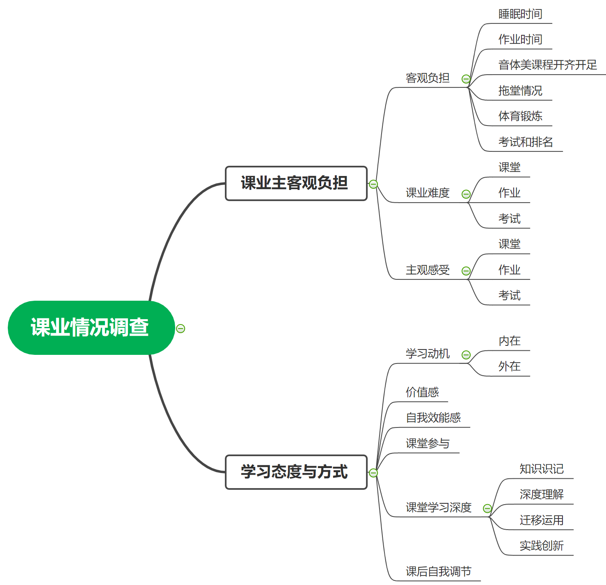

```{r setup, include=FALSE}
knitr::opts_chunk$set(
  echo = FALSE,
  fig.cap = TRUE,
  message = FALSE,
  warning = FALSE,
  fig.showtext = TRUE,
  dpi = 300,
  fig.align = "center",
  fig.asp = 0.6,
  fig.width = 5,
  out.width = "\\textwidth" #' 99%',
)

options(digits = 4)
```


```{r}
library(tidyverse)
library(stringr)
library(readxl)
library(flextable)
library(officedown)
library(officer)
library(ragg)

load("data/myData_df5.Rdata")

source("_common.R", encoding = "UTF-8")
```


```{r}
fp <- fp_par(text.align = "justify", 
             padding = 10,
             line_spacing = 1.5,
             keep_with_next = TRUE)
```

# 调查概况
## 调查目的和内容

`r ftext("空格", fp_text(color = "white"))`本次调查时为了了解学生在校学习的课业负担和学习过程，为学校管理完善和教学方式改进提供基础参考。调查内容包括课业负担和学习态度与方式两个主要板块。课业负担主要从客观负担、课业难度和主观感受三个方面进行考查；学习态度与方式从学习动机、价值感、自我效能感、课堂参与、课堂学习深度、课后自我调节六个方面进行考查。五、六年级调查的学习态度方法分别针对调考的数学、语文学科。`r fp`

## 调查方法

`r ftext("空格", fp_text(color = "white"))`本次调查采用网络问卷调查的方式进行，问卷为自编问卷，参考了国外PISA、TIMSS等学生大型测评项目中的调查问卷和学习动机性策略问卷（MSLQ）、学习过程问卷（LPQ）等针对学习过程的量表型问卷。同时，客观负担部分主要参考了教育部等九部门关于印发中小学生减负措施的通知（教基〔2018〕26号）、中共中央 国务院关于深化教育教学改革全面提高义务教育质量的意见（2019年6月23日）等政策文件中对睡眠时间、作业时间等的要求。具体如下：`r fp`


```{r zcyj, eval=FALSE}
zcyj <- readxl::read_excel("./data/zcyj.xlsx")
zcyj %>%
  flextable() %>%
  width(j = 2:3, width = 1.5) %>% 
  height_all(height = 0.1) %>%
  #fit_to_width(max_width = 10) %>%
  width(j = 1, width = 1) %>% 
  width(j = 3, width = 3) %>% 
  fontsize(size = 9, part = "all") 
```


问卷的指标框架如下：`r fp`

```{r, out.width='89%', fig.asp = 1, fig.align='center', fig.cap='调查框架和指标体系', eval=FALSE}

```


## 调查数据

`r ftext("空格", fp_text(color = "white"))`与本次学科调考的成绩关联后，五、六年级的有效数据分别为37所学校的8,440人、36所学校的7,665人。每所学校的具体人数统计如下：`r fp`


```{r tab.cap='有效学生总数', tab.id='有效学生总数'}
df5_all %>% 
  select(school, starts_with("num_effect")) %>%
  set_names(c("学校", "五年级")) %>%
  flextable_print() %>%
  height_all(height = 0.1) %>%
  fit_to_width(max_width = 6) %>%
  fontsize(size = 9, part = "body") 
```


# 五年级结果分析

## 主要结论


## 课业主客观负担
### 客观负担


`r ftext("空格", fp_text(color = "white"))`根据调查数据结果，全区五年级睡眠时间、家庭作业时间、音乐课开课情况、美术课开课情况、体育课开课情况、参加体育锻炼时间、统考次数、考试成绩公布和排名的达标率分别为45.14%、76.82%、85.07%、85.13%、83.82%、90.55%、63.35%、73.61%。具体如下：`r fp`


```{r, fig.width= 6, fig.height = 3, fig.cap= "全区五年级课业客观负担达标率"}
df5_all %>%
  filter(level == "district") %>%
  select(starts_with("percent_")) %>%
  rename_with(everything(), .fn = ~str_replace_all(.x, pattern = pairs56)) %>%
  pivot_longer(
    cols = everything(),
    names_to = "index",
    values_to = "value"
  ) %>%
  mutate(value = as.numeric(value)) %>%
  ggplot(aes(x = value, y = fct_reorder(index, value)) ) +
  geom_col(width = 0.6, fill = "#268bd2") +
  geom_text(aes(label = value), hjust = 1, color = "black") +
  theme_classic() +
  scale_x_continuous( expand = c(0, 0)) +
  labs(x = NULL, y = NULL)
  
```

`r ftext("空格", fp_text(color = "white"))`在学校层面，草堂小学、鼓楼小学、实小明道分校、实小青华分校、实小文苑分校、实验小学、双眼井小学五年级在所有指标上的达标率都高于区平均达标率；彩虹小学、金沙小学、少城小学、新华路小学五年级在所有指标上的达标率都低于区平均达标率。具体如下：`r fp`

```{r tab.cap='五年级客观负担达标率', tab.id='五年级客观负担达标率', eval=FALSE}
df5_all %>%
  select(school, starts_with("percent_")) %>%
  mutate(
    across(starts_with("percent_"), list(RC = ~. >= last(.) ))
    ) %>% 
  rowwise() %>% 
  mutate(
    num_above_mean = sum(c_across(ends_with("_RC")))
  ) %>% 
  ungroup() %>% 
  select(-ends_with("_RC")) %>%
  arrange(desc(num_above_mean)) %>%
  arrange(school %in% c("全区")) %>%
  
  rename_with(everything(), .fn = ~str_replace_all(.x, pattern = pairs56)) %>%
  flextable_print() %>% 
  fit_to_width(max_width = 8) %>%
  fontsize(size = 8, part = "body") %>%
  add_footer_row(values = "说明：灰色底纹表示得分率高于或等于区平均达标率，下同。", colwidths = 10)
```


```{r, fig.width = 6, fig.asp= 1.5}
library(showtext)
showtext_auto()
library(ggthemr)
ggthemr("solarized")
# ggthemr::swatch()
# colorspace::swatchplot(ggthemr::swatch())

library(ggtext)

text_caption <- glue::glue(
  "说明：<span style ='color:#dc322f;'>红色</span>代表高于区平均达标率，<span style = 'color:#268bd2;'>蓝色</span>代表低于区平均达标率"
)


levels <- c(
  "percent_sleep_time",
  "percent_homework_time",
  "percent_music",
  "percent_art",
  "percent_sport",
  "percent_hours_exercise",
  "percent_test_score",
  "percent_score_rank"
)

labels <- c(
  "睡眠时间",
  "家庭作业\n时间",
  "音乐课\n开课情况",
  "美术课\n开课情况",
  "体育课\n开课情况",
  "参加体育\n锻炼时间",
  "统考次数",
  "考试成绩\n公布和排名"
)


df5_all %>%
  select(school, starts_with("percent_")) %>%
  pivot_longer(
    cols = starts_with("percent_"),
    names_to = "index",
    values_to = "values"
  ) %>%
  group_by(index) %>%
  mutate(values_diff = values - last(values)) %>%
  ggplot(aes(
    x = factor(index, levels),
    y = forcats::fct_relevel(school, "全区"),
    size = values_diff,
    color = -sign(values_diff)
  )) +
  geom_point() +
  geom_text(aes(label = scales::label_percent(scale = 1, accuracy = .01)(values)),
    color = "white",
    size = 2
  ) +
  # scale_x_discrete(labels = function(x) str_replace_all(x, pattern = pairs56)) +
  scale_x_discrete(labels = labels) +
  scale_size_continuous(range = c(4, 10)) +
  theme( # axis.text.x = element_text(angle = 45, hjust = 1),
    legend.position = "none",
    plot.caption = element_markdown(
      size = 8,
      color = "grey50",
      family = "simsun",
      face = "italic",
      hjust = 0
    )
  ) +
  labs(
    x = NULL, y = NULL,
    title = "各校五年级客观学习负担达标率",
    caption = text_caption
  )


# ggsave("one.pdf", height = 14, width = 6)


ggthemr_reset()
```


`r ftext("空格", fp_text(color = "white"))` 与2019年的调查数据对比，除了睡眠时间，全区五年级学生在家庭作业时间、音乐课开课情况、美术课开课情况、体育课开课情况、参加体育锻炼时间、统考次数、考试成绩公布和排名上的达标率均有所提升。因此，就纵向比较而言，全区在减轻学生课业客观负担上效果显著。具体如下：（各学校的情况，见附录）`r fp`


```{r, fig.cap= "全区五年级课业客观负担达标率与去年对比"}
file <- knitr::fig_path('percent.png')

agg_png(file, res = 300, height = 3.6, width = 6, units = "in")

levels <- c(
    "睡眠时间", 
    "家庭作业时间", 
    "音乐课开课情况",
    "美术课开课情况", 
    "体育课开课情况",
    "参加体育锻炼时间", 
    "考试成绩公布和排名"
)


p <- df5_burden_percent_combine %>%
  filter(level == "district") %>%
  pivot_longer(
    cols = starts_with("value"),
    names_to = "year",
    names_pattern = "value(\\d+)",
    values_to = "value"
  ) %>%
  mutate(value = as.numeric(value)) %>%
  ggplot(aes(x = factor(index, levels), 
             y = value, fill = year, label = value)
         ) +
  geom_col(width = 0.6, position = position_dodge(0.6)) +
  geom_text(position = position_dodge(width = 0.9),
            vjust = -0.5,
            size = 3
            ) +
  scale_fill_manual(
    values = c( "2019" = "#268bd2", "2020" = "#dc322f")
   ) +
  scale_x_discrete(
    labels =  c("睡眠时间", 
                "家庭作业\n时间", 
                "音乐课\n开课情况",
                "美术课\n开课情况", 
                "体育课\n开课情况",
                "参加体育\n锻炼时间", 
                "考试成绩\n公布和排名")
  ) +
  scale_y_continuous(expand = expansion(mult = c(0, .12))) +
  theme_classic() +
  theme(legend.position = "top") +
  labs(x = NULL, y = NULL, fill = "年份") 


print(p)
invisible(dev.off())

knitr::include_graphics(file)
```


或者

```{r, fig.cap= "全区五年级课业客观负担达标率与去年对比"}
levels <- c(
    "睡眠时间", 
    "家庭作业时间", 
    "音乐课开课情况",
    "美术课开课情况", 
    "体育课开课情况",
    "参加体育锻炼时间", 
    "考试成绩公布和排名"
)


df5_burden_percent_combine %>%
  filter(level == "district") %>%
  pivot_longer(
    cols = starts_with("value"),
    names_to = "year",
    names_pattern = "value(\\d+)",
    values_to = "value"
  ) %>%
  mutate(value = as.numeric(value)) %>%
  ggplot(aes(x = factor(index, levels), 
             y = value, fill = year, label = value)
         ) +
  geom_col(width = 0.6, position = position_dodge(0.6)) +
  geom_text(position = position_dodge(width = 0.9),
            vjust = -0.5,
            size = 3
            ) +
  scale_fill_manual(
    values = c( "2019" = "#268bd2", "2020" = "#dc322f")
   ) +
  scale_x_discrete(
    labels =  c("睡眠时间", 
                "家庭作业\n时间", 
                "音乐课\n开课情况",
                "美术课\n开课情况", 
                "体育课\n开课情况",
                "参加体育\n锻炼时间", 
                "考试成绩\n公布和排名")
  ) +
  scale_y_continuous(expand = expansion(mult = c(0, .12))) +
  theme_classic() +
  theme(legend.position = "top") +
  labs(x = NULL, y = NULL, fill = "年份") 

```


`r ftext("空格", fp_text(color = "white"))`此外，本次调查还考查了教师拖堂情况。根据调查数据结果，全区五年级学生报告语文老师、数学老师、英语老师、其他课的老师拖堂的比例分别为14.88%、17.91%、6.03%、5.26%，整体上74.38%的老师没有拖堂。可见，语文和数学老师拖堂的情况明显多于其他学科教师。具体如下`r fp`

```{r, fig.width= 6, fig.height = 3, fig.cap= "全区五年级老师拖堂比例"}
df5_all %>%
  filter(level == "district") %>%
  select(starts_with("teacher_")) %>%
  rename_with(everything(), .fn = ~str_replace_all(.x, pattern = pairs56)) %>%
  pivot_longer(
    cols = everything(),
    names_to = "index",
    values_to = "value"
  ) %>%
  mutate(value = as.numeric(value)) %>%
  ggplot(aes(x = value, y = fct_reorder(index, value)) ) +
  geom_col(width = 0.6, fill = "#268bd2") +
  geom_text(aes(label = value), hjust = 1) +
  theme_classic() +
  scale_x_continuous( expand = c(0, 0)) +
  labs(x = NULL, y = NULL)
  
```


`r ftext("空格", fp_text(color = "white"))`学校层面五年级各校教师拖堂比例统计如下：`r fp`

```{r tab.cap='五年级拖堂情况比例', tab.id='五年级拖堂情况比例'}
df5_all %>%
  select(school, starts_with("teacher_")) %>%
  rename_with(everything(), .fn = ~str_replace_all(.x, pattern = pairs56)) %>%
  flextable_print() %>% 
  fit_to_width(max_width = 6) %>%
  fontsize(size = 9, part = "body") 
```


### 课业难度

`r ftext("空格", fp_text(color = "white"))`根据调查数据结果，全区学生感知的语文/数学课业难度不高，但考试的难度明显高于课堂和作业。具体如下：`r fp`

```{r, fig.width= 5, fig.height = 2, fig.cap= "全区五年级数学课业难度得分率"}
df5_all %>%
  filter(level == "district") %>%
  select(starts_with("f_hard_")) %>%
  rename_with(everything(), .fn = ~str_replace_all(.x, pattern = pairs56)) %>%
  pivot_longer(
    cols = everything(),
    names_to = "index",
    values_to = "value"
  ) %>%
  mutate(value = as.numeric(value)) %>%
  ggplot(aes(x = value, y = fct_reorder(index, value)) ) +
  geom_col(width = 0.6, fill = "#268bd2") +
  geom_text(aes(label = value), hjust = 1, color = "black") +
  theme_classic() +
  scale_x_continuous( expand = c(0, 0)) +
  labs(x = NULL, y = NULL)
  
```


```{r tab.cap='五年级数学学业难度得分率', tab.id='五年级数学学业难度得分率', eval=FALSE}
df5_all %>%
  select(school, starts_with("f_hard_")) %>%
  rename_with(everything(), .fn = ~str_replace_all(.x, pattern = pairs56)) %>%
  flextable_print() %>% 
  fit_to_width(max_width = 6) %>%
  fontsize(size = 9, part = "body") 
```


`r ftext("空格", fp_text(color = "white"))`五年级各校学生感知的数学课业难度得分率统计如下：`r fp`

```{r tab.cap='五年级学业难度得分率', tab.id='五年级学业难度得分率'}
df5_all %>%
  select(school, starts_with("f_hard_")) %>%
  set_names(c("学校", 
              "五年级课堂难度",
              "五年级作业难度",
              "五年级考试难度" )
            ) %>%
  flextable_print() %>% 
  fit_to_width(max_width = 6) %>%
  fontsize(size = 9, part = "body") 
```


### 主观感受

`r ftext("空格", fp_text(color = "white"))`
根据调查数据结果，全区五年级学生对课堂、考试和作业主要以积极的体验为主，具体表现为数学课上开心、数学考试高兴、数学作业享受；同时，也存在一定的消极情绪，如数学课上紧张、数学考试紧张、数学作业焦虑、数学作业厌倦等，在消极情绪中，课堂的消极情绪高于考试和作业。`r fp`


```{r, fig.width= 5, fig.height = 2.5, fig.cap= "全区五年级数学主观感受得分率"}
df5_all %>%
  filter(level == "district") %>%
  select(starts_with("f_feeling_")) %>%
  rename_with(everything(), .fn = ~str_replace_all(.x, pattern = pairs56)) %>%
  pivot_longer(
    cols = everything(),
    names_to = "index",
    values_to = "value"
  ) %>%
  mutate(value = as.numeric(value)) %>%
  ggplot(aes(x = value, y = fct_reorder(index, value)) ) +
  geom_col(width = 0.6, fill = "#268bd2") +
  geom_text(aes(label = value), hjust = 1) +
  theme_classic() +
  scale_x_continuous( expand = c(0, 0)) +
  labs(x = NULL, y = NULL)
  
```

`r ftext("空格", fp_text(color = "white"))`五年级各校学生主观感受到的数学课业情绪得分率统计如下：`r fp`

```{r tab.cap='五年级学习主观感受得分率', tab.id='五年级学习主观感受得分率'}
df5_all %>%
  select(school, starts_with("f_feeling_")) %>%
  rename_with(everything(), .fn = ~str_replace_all(.x, pattern = pairs56)) %>%
  flextable_print() %>%
  vline(j = c('课堂积极情绪', '考试积极情绪'), part = "all") %>% 
  fit_to_width(max_width = 6) %>%
  fontsize(size = 9, part = "body") 
```


## 学习态度与方式

### 学习态度价值与效能


`r ftext("空格", fp_text(color = "white"))`根据调查数据结果，全区五年级学生对数学价值的认可得分率最高，为92.37%，其中，表明绝多数学生都认为在数学课上所学的东西在实际生活中会用到的，所学的数学知识在生活中很重要，需要学好数学。
学生学习内在和外在动机的得分率分别为85.53%、73.52%，其中，说明整体上学生学习的动力来自自己的兴趣、好奇心等内在需求要多于来自与他人的竞争和升学的需要。
学生数学学习自我效能感的得分率为80.95%，其中，表明大多数学生觉得自己数学学得很好，擅长解答难的数学题，数学比其他任何科目都简单。`r fp`

```{r, fig.width= 6, fig.height = 2, fig.cap= "全区五年级数学学习态度情感得分率"}
df5_all %>%
  filter(level == "district") %>%
  select(
         f_learning_driven_internal, 
         f_learning_driven_external,
         f_learning_power,
         f_learning_valuable
         ) %>%
  rename_with(everything(), .fn = ~str_replace_all(.x, pattern = pairs56)) %>%
  pivot_longer(
    cols = everything(),
    names_to = "index",
    values_to = "value"
  ) %>%
  mutate(value = as.numeric(value)) %>%
  ggplot(aes(x = value, y = fct_reorder(index, value)) ) +
  geom_col(width = 0.6, fill = "#268bd2") +
  geom_text(aes(label = value), hjust = 1) +
  theme_classic() +
  scale_x_continuous( expand = c(0, 0)) +
  labs(x = NULL, y = NULL)
  
```

`r ftext("空格", fp_text(color = "white"))`五年级各校学生的数学学习态度价值得分率统计如下：`r fp`

```{r tab.cap='五年级数学学习态度情感得分率', tab.id='五年级数学学习态度情感得分率'}
df5_all %>%
  select( school,
         f_learning_driven_internal, 
         f_learning_driven_external,
         f_learning_power,
         f_learning_valuable
         ) %>%
  rename_with(everything(), .fn = ~str_replace_all(.x, pattern = pairs56)) %>%
  flextable_print() %>% 
  fit_to_width(max_width = 6) %>%
  fontsize(size = 9, part = "body") 
```


### 课堂学习与课后调节

`r ftext("空格", fp_text(color = "white"))`根据调查数据结果，针对数学课堂上的学习行为，全区五年级学生课堂参与的得分率为85.08%，表明学生课堂上在认真听老师讲课、积极和同学讨论、表达自己的观点、动脑筋思考老师提的问题、举手回答老师的提问、细观察老师呈现的事物、动手操作研究事物等方面能积极投入。`r fp`

`r ftext("空格", fp_text(color = "white"))`五年级数学课堂上涉及到知识识记的得分率为87.95%，涉及到深度理解的得分率为86.65%，涉及到迁移运用的得分率为88.25%，涉及到学习涉及知识创新的得分率为81.72%。可见目前课堂上的学习已经在追求深度，除了奠定知识识记的基础，越来越关注知识的理解和运用，由数据可知最高层次的实践创新相对弱一些。`r fp`

`r ftext("空格", fp_text(color = "white"))`数学课后学生自我调节的得分率为86.08%，表明大多数学生都能够根据自己的学习情况进行自我评估、反思困惑，调整学习目标、方式。`r fp`


```{r, fig.width= 6, fig.height = 2.5, fig.cap= "全区五年级数学课堂学习与调节得分率"}
df5_all %>%
   filter(level == "district") %>%
   select(
     "f_knowledge_activity_inclass",
     "f_knowledge_learning_strategy",
     "f_knowledge_memory", 
     "f_knowledge_mastery",
     "f_knowledge_apply",
     "f_knowledge_creative"
   ) %>%
  rename_with(everything(), .fn = ~str_replace_all(.x, pattern = pairs56)) %>%
  pivot_longer(
    cols = everything(),
    names_to = "index",
    values_to = "value"
  ) %>%
  mutate(value = as.numeric(value)) %>%
  ggplot(aes(x = value, y = fct_reorder(index, value)) ) +
  geom_col(width = 0.6, fill = "#268bd2") +
  geom_text(aes(label = value), hjust = 1) +
  theme_classic() +
  scale_x_continuous( expand = c(0, 0)) +
  labs(x = NULL, y = NULL)
  
```

`r ftext("空格", fp_text(color = "white"))`五年级各校学生数学学习与调节的得分率统计如下：`r fp`

```{r tab.cap='五年级数学课堂学习与调节得分率', tab.id='五年级数学课堂学习与调节得分率'}
df5_all %>%
  select(school, 
     "f_knowledge_activity_inclass",
     "f_knowledge_learning_strategy",
     "f_knowledge_memory", 
     "f_knowledge_mastery",
     "f_knowledge_apply",
     "f_knowledge_creative"
         ) %>%
  rename_with(everything(), .fn = ~str_replace_all(.x, pattern = pairs56)) %>%
  flextable_print() %>% 
  fit_to_width(max_width = 6) %>%
  fontsize(size = 9, part = "body") 
```


## 学习成绩的关联分析

`r ftext("空格", fp_text(color = "white"))`建立数学成绩的回归模型，将本次调查涉及到的各个指标纳入模型，选取模型拟合后对数学成绩有显著影响的指标，同时结合两者关联的趋势，选取有代表性的指标，分析全区所有学校在这些指标和数学成绩上的象限分布，明确各个学校在每种关联中的表现和相对位置。具体如下：`r fp`


### 客观负担与学业成绩

```{r, fig.asp= 0.8}
ggthemr('solarized')
library(ggrepel)


df5_all_index <- df5_all %>%
  select(school, score_test, starts_with("percent_")) %>%
  mutate(
    across(starts_with("percent_"), list(RC = ~. >= last(.) ))
    ) %>% 
  rowwise() %>% 
  mutate(
    num_above_mean = sum(c_across(ends_with("_RC")))
  ) %>% 
  ungroup() %>% 
  select(-ends_with("_RC")) 


df5_all_index %>% 
  mutate(quadrant = case_when(
      score_test > last(score_test) & num_above_mean >= 4 ~ "d1",
      score_test > last(score_test) & num_above_mean  < 4 ~ "d2",
      score_test < last(score_test) & num_above_mean >= 4 ~ "d3",
      score_test < last(score_test) & num_above_mean  < 4 ~ "d4",
      TRUE ~  "other")
      ) %>%
  ggplot(aes(x = num_above_mean, y = score_test, color = quadrant)) +
  geom_point( size = 5) +
  geom_text_repel(
    aes(label = school),
    size = 3
  ) +
  geom_hline(aes(yintercept = last(score_test))) +
  geom_vline(xintercept = 4) +
  #scale_y_continuous(limits = c(77, 100)) + 
  scale_x_continuous(breaks = seq(0, 12, 1)) + 
  labs(x = "指标达标率高于全区均值的数量", y = "学生平均成绩",
       title = "达标率高于全区均值的数量与学生成绩的关联（五年级）"
       ) +
  theme(legend.position = "none") 
  
```


```{r, eval=FALSE}
df5_all %>% 
  filter(level == "school") %>%
  select(-starts_with("percent_"), 
         -starts_with("teacher_"), 
         -num_effect, 
         -class_id,
         -level
         ) %>%
  pivot_longer(
    cols = -c(school, score_test),
    names_to = "index",
    values_to = "value"
  ) %>%
  nest_by(index) %>%
  summarise(
    broom::tidy(lm(score_test ~ 1 + value, data = data))
  ) %>%
  ungroup() %>%
  mutate(index = recode(index, !!!pairs56)) %>%
  #filter(term == "value") %>%
  #filter(p.value < 0.009) %>% 
  mutate(
    across(p.value, scales::label_pvalue(accuracy = 0.001))
  )#%>% 
  #write.csv("5.csv")
  
```


### 课业难度与学业成绩 -->
```{r, fig.asp= 0.8, eval=FALSE}
df5_all %>%
  correlate_plot(vars = f_hard_class, title = "五年级")

df5_all %>%
  correlate_plot(vars = f_hard_homework, title = "五年级")

df5_all %>%
  correlate_plot(vars = f_hard_test, title = "五年级")
```

### 主观感受与学业成绩

```{r, fig.asp= 0.8, eval=FALSE}
df5_all %>%
  correlate_plot(vars = f_feeling_negative_class, title = "五年级")

df5_all %>%
  correlate_plot(vars = f_feeling_positive_class, title = "五年级")

```


### 学习态度价值效能与学业成绩

```{r, fig.asp= 0.8, eval=FALSE}
df5_all %>%
  correlate_plot(vars = f_learning_driven_external, title = "五年级")

df5_all %>%
  correlate_plot(vars = f_learning_driven_internal, title = "五年级")

```


### 课堂学习课后调节与学业成绩

```{r, fig.asp= 0.8, eval=FALSE}
df5_all %>%
  correlate_plot(vars = f_learning_activity_inclass, title = "五年级")

df5_all %>%
  correlate_plot(vars = f_learning_strategy, title = "五年级")


df5_all %>%
  correlate_plot(vars = f_knowledge_memory, title = "五年级")


df5_all %>%
  correlate_plot(vars = f_knowledge_mastery, title = "五年级")


df5_all %>%
  correlate_plot(vars = f_knowledge_apply, title = "五年级")


df5_all %>%
  correlate_plot(vars = f_knowledge_creative, title = "五年级")
```


# 改进建议

# 附录


```{r tab.cap='与2019年对比-五年级', tab.id='与2019年对比-五年级'}
df5_burden_percent_combine %>%
  select(-group) %>%
  set_names(c("学校", "指标", "2020年达标率", "2019年达标率")) %>%
  flextable(cwidth = 1.3) %>% 
  bg(~ `2020年达标率` > `2019年达标率`, j = 3, bg = "gray", part = "body") %>% 
  hline(i = seq(from= 7, to = 37*7, by = 7)) %>%
  add_footer_row(
    values = "说明：灰色代表2020年达标率高于2019年的达标率。", colwidths = 4) %>% 
  fit_to_width(max_width = 6) %>%
  fontsize(size = 9, part = "body") 
```


```{r echo=FALSE, fig.height=3, fig.width=3.5,eval=FALSE}
## 五年级各选项的分布
df5_start %>%
  select(starts_with("t")) %>%
  map( function(x)  janitor::tabyl(x) )

## 五年级各选项的分布

df5_prop <- df5_start %>%
  select(starts_with("t")) %>%
  mutate(
    across(starts_with("t"), as.character)
  ) %>%
  purrr::imap_dfr(
        function(x, name) { 
            table_1 <- janitor::tabyl(x)
            table_1$column_name <- name
            table_1
        }
    ) %>%
  as_tibble() %>%
  select(question = column_name, item = x, n, prop = percent)


library(ggthemr) 
ggthemr('dust')
cols <- swatch()[-1]
df5_prop %>% 

  group_by(question) %>% 
  group_map(
      ~ggplot(data = .x, 
          aes(x = fct_reorder(item, prop), 
                 y = prop, 
                 fill = fct_reorder(item, -prop))
               ) +
          geom_col() +
          scale_fill_manual(values = cols) +
          geom_text(
            aes(label = scales::percent(prop, accuracy = 0.01), hjust = 1),
            size = 6) +
          coord_flip() + 
          scale_y_continuous(limits = c(0, 0.8), expand = c(0, 0),
                             labels = scales::percent_format(accuracy = 1)) +
          labs(x = "", y = "") +
          ggtitle(.y) +
          theme_classic(base_size = 18) +
          theme(legend.position = "none")
    ) 
```


